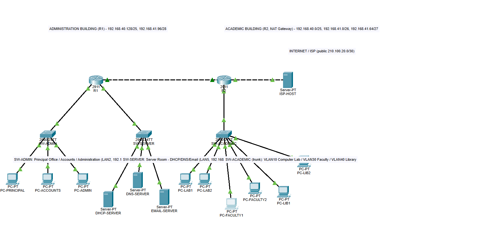

# FutureVision Institute — Campus Network

Implementation of a campus network for FutureVision Institute using RIP v2, centralized DHCP, DNS (`futurevision.local`), an Email server, and NAT — built and verified in Cisco Packet Tracer 9.0.1.



## Contents

- [`FutureVision_Campus_Network.pkt`](FutureVision_Campus_Network.pkt) — the completed Packet Tracer project
- [`screenshots/`](screenshots) — topology captures
- This README — full technical report (VLSM, addressing, configs, test results, issues log)

## Scenario & design decisions

The brief lists 7 rooms (Principal Office, Accounts, Administration, Server Room, Faculty Office, Computer Laboratory, Library) but only 5 LAN host-count targets, so two consolidation calls were made:

1. **Principal Office + Accounts + Administration** share one LAN ("Administration general", 70 hosts) — same building, same trust zone.
2. **Server Room** maps to the smallest LAN (12 hosts) — three servers plus headroom is realistic.

**Topology:** R1 serves the Administration Building (LAN2 + LAN5). R2 serves the Academic Building (LAN1, LAN3, LAN4) and doubles as the NAT gateway. A Cisco 2911 only has 3 onboard Gigabit ports, and R2 needed 3 LANs + WAN + Internet — solved with router-on-a-stick (VLANs 10/30/40 trunked to SW-ACADEMIC, subinterfaces on R2 Gi0/0).

## 1. VLSM Addressing Plan

Base block: `192.168.40.0/22` (192.168.40.0 – 192.168.43.255).

| LAN | Dept (building) | Hosts req. | Mask | Network | Usable range | Broadcast |
|---|---|---|---|---|---|---|
| LAN1 | Computer Laboratory (Academic) | 80 | /25 | 192.168.40.0 | .1–.126 | .127 |
| LAN2 | Administration general (Admin) | 70 | /25 | 192.168.40.128 | .129–.254 | .255 |
| LAN3 | Faculty Office (Academic) | 35 | /26 | 192.168.41.0 | .1–.62 | .63 |
| LAN4 | Library (Academic) | 18 | /27 | 192.168.41.64 | .65–.94 | .95 |
| LAN5 | Server Room — DHCP/DNS/Email (Admin) | 12 | /28 | 192.168.41.96 | .97–.110 | .111 |
| WAN | R1 ↔ R2 point-to-point | 2 | /30 | 192.168.41.112 | .113–.114 | .115 |

`192.168.41.116 – 192.168.43.255` reserved for growth. The NAT outside link uses the separate public block `210.100.20.0/30` (R2 = `.2` as specified, ISP test host = `.1`).

## 2. Complete IP Addressing Table

### Router interfaces

| Device | Interface | IP Address | Mask | Role |
|---|---|---|---|---|
| R1 | GigabitEthernet0/0 | 192.168.40.129 | /25 | LAN2 gateway (Administration) |
| R1 | GigabitEthernet0/1 | 192.168.41.97 | /28 | LAN5 gateway (Server Room) |
| R1 | GigabitEthernet0/2 | 192.168.41.113 | /30 | WAN to R2 |
| R2 | Gi0/0.10 | 192.168.40.1 | /25 | LAN1 gateway (Computer Lab, VLAN 10) |
| R2 | Gi0/0.30 | 192.168.41.1 | /26 | LAN3 gateway (Faculty, VLAN 30) |
| R2 | Gi0/0.40 | 192.168.41.65 | /27 | LAN4 gateway (Library, VLAN 40) |
| R2 | GigabitEthernet0/1 | 192.168.41.114 | /30 | WAN to R1 |
| R2 | GigabitEthernet0/2 | 210.100.20.2 | /30 | NAT outside / Internet (required public IP) |

### Servers & end hosts

| Device | IP / Mode | Gateway | LAN |
|---|---|---|---|
| DHCP-SERVER | 192.168.41.98/28 (static) | 192.168.41.97 | LAN5 |
| DNS-SERVER | 192.168.41.99/28 (static) | 192.168.41.97 | LAN5 |
| EMAIL-SERVER | 192.168.41.100/28 (static) | 192.168.41.97 | LAN5 |
| ISP-HOST | 210.100.20.1/30 (static) | 210.100.20.2 | Outside/Internet test host |
| PC-PRINCIPAL | 192.168.40.130 (DHCP) | 192.168.40.129 | LAN2 |
| PC-ACCOUNTS | 192.168.40.131 (DHCP) | 192.168.40.129 | LAN2 |
| PC-ADMIN | 192.168.40.132 (DHCP) | 192.168.40.129 | LAN2 |
| PC-LAB1 | 192.168.40.2 (DHCP) | 192.168.40.1 | LAN1 (VLAN 10) |
| PC-LAB2 | 192.168.40.3 (DHCP) | 192.168.40.1 | LAN1 (VLAN 10) |
| PC-FACULTY1 | 192.168.41.3 (DHCP) | 192.168.41.1 | LAN3 (VLAN 30) |
| PC-FACULTY2 | 192.168.41.2 (DHCP) | 192.168.41.1 | LAN3 (VLAN 30) |
| PC-LIB1 | 192.168.41.66 (DHCP) | 192.168.41.65 | LAN4 (VLAN 40) |
| PC-LIB2 | 192.168.41.67 (DHCP) | 192.168.41.65 | LAN4 (VLAN 40) |

## 3. Topology

18 devices, 17 links. Naming: `R1`, `R2`, `SW-ADMIN`, `SW-SERVER`, `SW-ACADEMIC`, `DHCP-SERVER`, `DNS-SERVER`, `EMAIL-SERVER`.

## 4. RIP v2 Configuration

```
router rip
 version 2
 network 192.168.40.0
 network 192.168.41.0
 no auto-summary
```

Applied identically on R1 and R2. Every LAN, the WAN link, and both subinterface groups fall inside the classful `192.168.40.0/24` and `192.168.41.0/24` ranges, so two `network` statements per router cover everything. The NAT-outside link (`210.100.20.0/30`) is deliberately excluded — never advertised, marking the boundary between the campus network and the ISP.

## 5. NAT Configuration (PAT / Overload)

Configured on **R2**, using the required public address `210.100.20.2`.

```
interface GigabitEthernet0/1
 ip nat inside          ! WAN link to R1 (carries Admin-building traffic too)
interface GigabitEthernet0/2
 ip nat outside         ! public 210.100.20.2/30, faces ISP-HOST
interface GigabitEthernet0/0.10
 ip nat inside          ! Computer Lab
interface GigabitEthernet0/0.30
 ip nat inside          ! Faculty
interface GigabitEthernet0/0.40
 ip nat inside          ! Library

access-list 1 permit 192.168.40.0 0.0.3.255   ! covers the whole /22 in one line
ip nat inside source list 1 interface GigabitEthernet0/2 overload

ip route 0.0.0.0 0.0.0.0 210.100.20.1         ! default route to the ISP side
```

R1 also has a default static route (`ip route 0.0.0.0 0.0.0.0 192.168.41.114`) pointing at R2, since RIP alone only carries the internal /22 routes.

**Verified:** a real DHCP client (PC-PRINCIPAL, 192.168.40.130) successfully pinged ISP-HOST (210.100.20.1) — a host with no route back to the private network except via the translated public address.

## 6. DHCP

Centralized on **DHCP-SERVER** (192.168.41.98). DHCP relay (`ip helper-address`) forwards requests from every remote LAN across the WAN:

```
! R1
interface GigabitEthernet0/0
 ip helper-address 192.168.41.98

! R2
interface GigabitEthernet0/0.10
 ip helper-address 192.168.41.98
interface GigabitEthernet0/0.30
 ip helper-address 192.168.41.98
interface GigabitEthernet0/0.40
 ip helper-address 192.168.41.98
```

Pools:

| Pool name | Default gateway | DNS server | Start IP | Subnet mask | Max users |
|---|---|---|---|---|---|
| COMPUTER_LAB | 192.168.40.1 | 192.168.41.99 | 192.168.40.2 | 255.255.255.128 | 125 |
| ADMINISTRATION | 192.168.40.129 | 192.168.41.99 | 192.168.40.130 | 255.255.255.128 | 125 |
| FACULTY | 192.168.41.1 | 192.168.41.99 | 192.168.41.2 | 255.255.255.192 | 61 |
| LIBRARY | 192.168.41.65 | 192.168.41.99 | 192.168.41.66 | 255.255.255.224 | 29 |

Start addresses skip each LAN's gateway. LAN5 (Server Room) uses static IPs only. **Verified:** all 9 client PCs leased real addresses from the correct pool.

## 7. DNS

Domain `futurevision.local`, hosted on **DNS-SERVER** (192.168.41.99):

| Name | Type | Address |
|---|---|---|
| dhcp.futurevision.local | A | 192.168.41.98 |
| dns.futurevision.local | A | 192.168.41.99 |
| mail.futurevision.local | A | 192.168.41.100 |

**Verified:** all 3 records resolve correctly via real `nslookup` from client PCs.

## 8. Email

**EMAIL-SERVER** (192.168.41.100), SMTP + POP3 on. Domain set to **`futurevision.net`** — see the bug note below for why this differs from `.local`.

| User | Address | Assigned PC |
|---|---|---|
| principal | principal@futurevision.net | PC-PRINCIPAL |
| accounts | accounts@futurevision.net | PC-ACCOUNTS |
| admin.office | admin.office@futurevision.net | PC-ADMIN |
| lab1 | lab1@futurevision.net | PC-LAB1 |
| faculty1 | faculty1@futurevision.net | PC-FACULTY1 |
| librarian | librarian@futurevision.net | PC-LIB1 |

Both Incoming and Outgoing Mail Server are set to the server's raw IP (`192.168.41.100`) on every client, deliberately not the DNS hostname, so mail delivery doesn't depend on DNS.

**Verified:** a real message was composed and sent from PC-PRINCIPAL to `lab1@futurevision.net` and received successfully.

## 9. Testing Results

| Test | From → To | Result | What it proves |
|---|---|---|---|
| Deployment integrity | 18 devices / 17 links | PASS | Every device and link verified on the live canvas |
| Cross-WAN RIP route | DHCP-SERVER → 192.168.40.1 | PASS 4/4 | R1 learned R2's LAN1 subnet via RIPv2 |
| Cross-WAN RIP route | DHCP-SERVER → 192.168.41.65 | PASS 4/4 | R1 learned R2's LAN4 subnet via RIPv2 |
| Same-LAN switching | DNS-SERVER → 192.168.41.100 | PASS 4/4 | SW-SERVER forwards correctly within LAN5 |
| NAT / PAT (server) | DHCP-SERVER → 210.100.20.1 | PASS 3/4 | NAT translation confirmed live |
| Outside reachability | ISP-HOST → 210.100.20.2 | PASS 4/4 | R2's public interface up and reachable |
| DHCP leases, real clients | all 9 client PCs | PASS | Every PC leased correctly from its LAN's pool |
| Cross-building ping | PC-PRINCIPAL → PC-LAB1 | PASS 4/4 | Administration → Academic building, real clients |
| Inter-VLAN ping | PC-LAB1 (VLAN10) → PC-FACULTY1 (VLAN30) | PASS 3/4 | Router-on-a-stick subinterface routing works |
| Cross-building + cross-VLAN | PC-ADMIN → PC-LIB2 | PASS 3/4 | Full path: LAN2 → R1 → WAN → R2 → VLAN40 |
| NAT, real DHCP client | PC-PRINCIPAL → 210.100.20.1 | PASS 4/4 | Real end-user traffic reaches the Internet through NAT |
| DNS resolution | nslookup dhcp/dns/mail .futurevision.local | PASS | All 3 records resolve from a real DHCP client |
| Email send/receive | PC-PRINCIPAL → lab1@futurevision.net | PASS | Real SMTP send confirmed working |

A single lost packet (3/4, 25% loss) on first contact between two hosts is the normal ARP/NAT-table-build cost in Packet Tracer, not a fault.

## 10. Problems Encountered & How They Were Fixed

**1. R2 needed 5 connections, the 2911 only has 3 onboard ports.** Solved with router-on-a-stick: a single trunk from R2 Gi0/0 to SW-ACADEMIC carries VLANs 10/30/40 via three dot1Q subinterfaces, freeing Gi0/1 and Gi0/2 for WAN and NAT-outside.

**2. Packet Tracer's Server-PT "Services" tab isn't scriptable.** No automation API reaches DHCP pools, DNS records, or Email accounts — confirmed by enumerating every function the automation bridge exposes. These three services were configured by hand in the GUI; everything else (topology, addressing, routing, NAT, DHCP relay) was fully automated.

**3. Router-sourced pings fail in the verification tool.** A bug specific to IOS-console ping sourcing; worked around by using host devices as ping sources instead.

**4. Cable-type mismatches** on direct router/server links — fixed by specifying `cross` cabling for the R1↔R2 and R2↔ISP-HOST links.

**5. Configure Mail rejects the required `.local` domain, but Send requires it to match the server.** Packet Tracer 9.0.1's Configure Mail dialog silently rejects `.local` as a TLD when saving an address ("Invalid email address entered"), most likely a regex expecting a short 2–3 letter TLD. Separately, the actual SMTP send engine requires the client's domain to exactly match the domain configured on EMAIL-SERVER. These two requirements contradict each other for any `.local` domain. Resolved by moving the Email service only to `futurevision.net`, while DNS and DHCP keep `futurevision.local` exactly as required — clients never resolve the mail server by hostname anyway.

**6. DHCP pool entry silently overwrites instead of adding.** Editing a pool's fields while a previously-added row was still selected and clicking **Save** renamed/overwrote that row instead of creating a new one. Fix: deselect (click empty table space) before typing a new pool's values, and use **Add** specifically for new entries. Also hit two stray-character validation errors (an invalid DNS Server IP, an invalid domain string) caused by hidden characters left over from prior edits — fixed by clearing the field completely and retyping.

**7. DNS record edit doesn't always take effect.** The `mail.futurevision.local` A record looked byte-for-byte correct after editing but still resolved as "non-existent domain." Deleting it and re-adding it as a fresh entry fixed it immediately — a stale internal reference that an in-place edit doesn't clear.

**8. Accidental device rename during manual PC configuration.** Three Academic-building PCs got renamed by mistake instead of using the correct Administration-building devices. Caught via a topology screenshot and fixed directly with the automation bridge's rename function.

**9. Scripted DHCP mode-switch doesn't itself request a lease.** Setting a PC to DHCP mode via automation only sets the mode — the actual DORA exchange still needs the real "click DHCP" action in the PC's IP Configuration panel.

## Project files

- `FutureVision_Campus_Network.pkt` — Cisco Packet Tracer 9.0.1 project file
- `screenshots/futurevision_campus_topology.png` — initial deployed topology
- `screenshots/futurevision_campus_final.png` — final topology after full configuration
